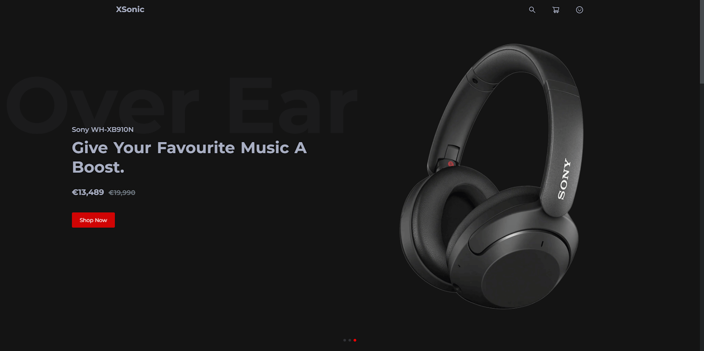
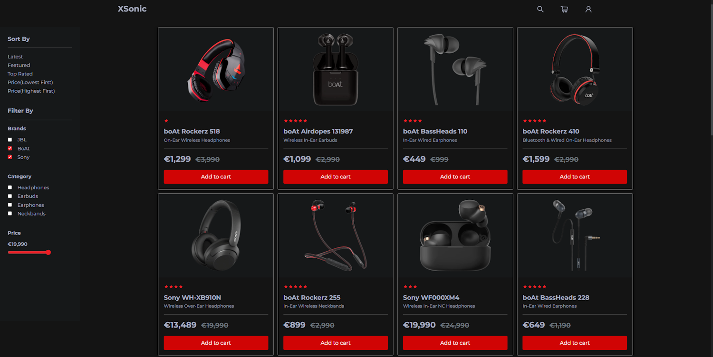
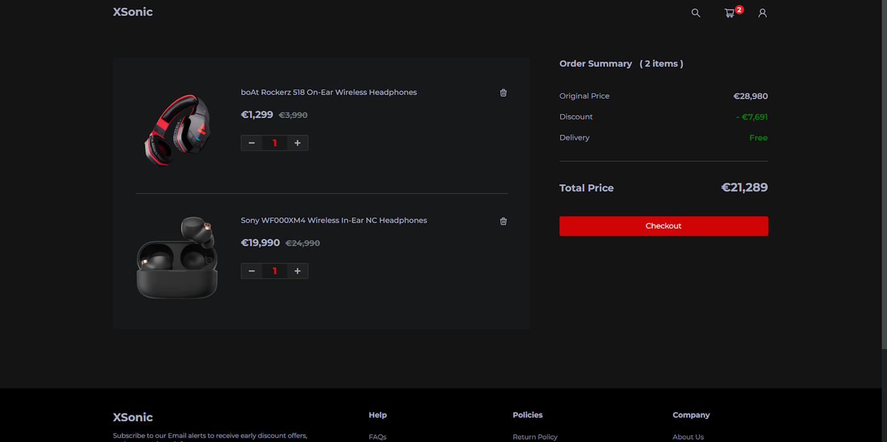
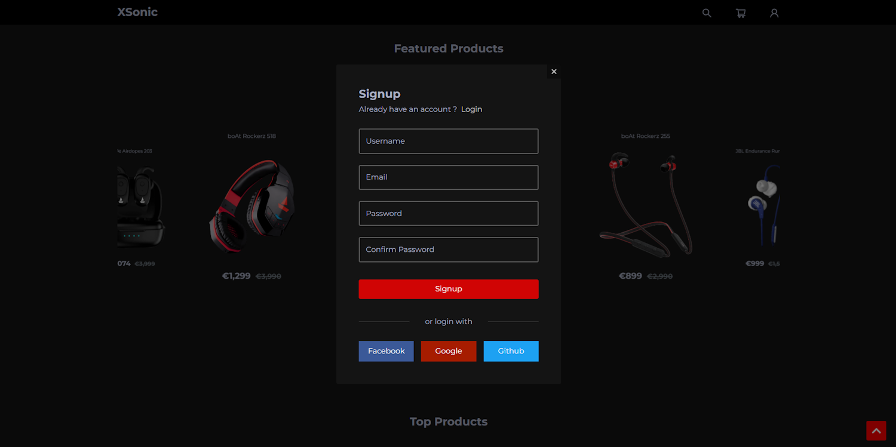
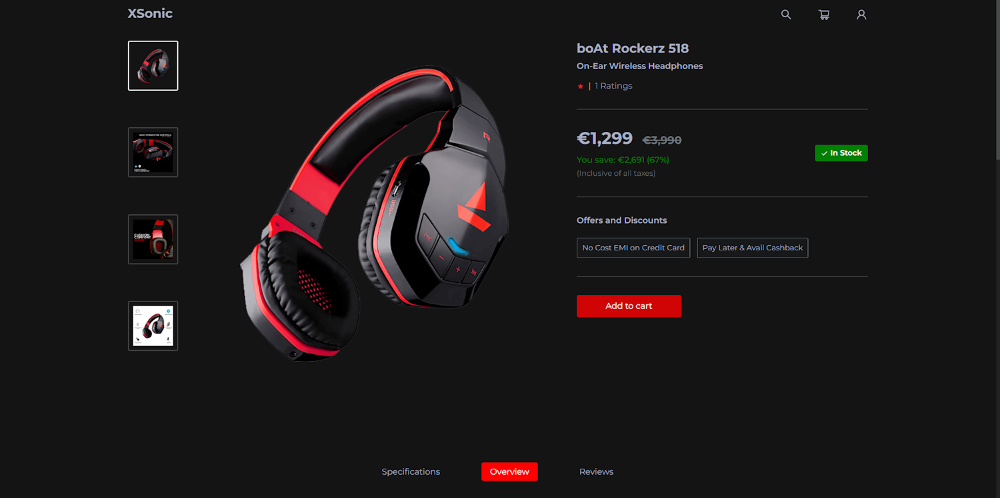
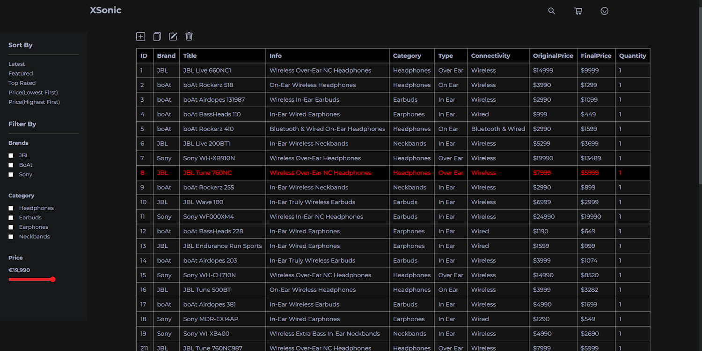
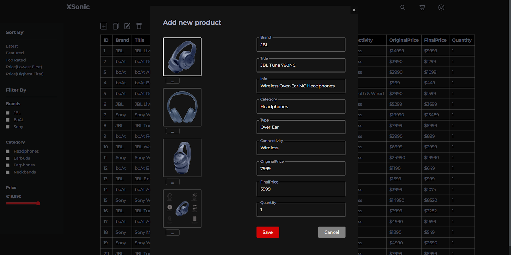

[![MIT Licensed][badge-mit]][license]

## XSonic | Spring Boot and React eCommerce Web App

### [Demo Link](https://xsonic.netlify.app/) 🔗

Audio Store eCommerce Web App, developed using **Spring Boot** and **React JS**.  
State management using Context API.
 

## Used Technologies:

* Back-end: Spring (Boot, Data, Security), JPA / Hibernate, PostgresSQL, JUnit, Mockito
* Front-end: React JS, React Router, React Swiper
* Security: JWT, OAuth2 Google, Facebook, GitHub
* REST API
* Server Build: Docker, Gradle
* Client Build: npm, yarn, webpack

## Features

* Authentication with JWT and Email validation.
* Authentication with Google, Facebook or GitHub
* Customers can search for the product according to the specified criteria.
* Customers can add and delete products from the shopping cart.
* Customers can order the products in the shopping cart.
* Customers can change their password and view their orders.
* Admin can add or modify a product.
* Admin can change the data of any user.
* Admin can view orders of all users.
* ...and much more

Register in gmail
* Configure reCAPTCHA: [link](https://www.google.com/recaptcha/admin#list), [guide](https://developers.google.com/recaptcha/docs/verify), [video guide (RUS)](https://youtu.be/7cDpbAbhyjc?t=212)
* Add  reCAPTCHA key to the application.yaml file: [link](https://i.ibb.co/nDTP8H5/prop-recaptcha.png) and to [link](https://github.com/merikbest/ecommerce-spring-reactjs/blob/4f74f86500ab9363c04a18412dd432bd913e0477/frontend/src/pages/Registration/Registration.tsx#L134)
* Add gmail account and password to the application.yaml file: [link](https://i.ibb.co/0tRr1Gy/props-gmail.png)
* Go to [link](https://myaccount.google.com/u/2/lesssecureapps) (important) and change to: “Allow less secure apps: ON”
* Configure OAuth2: [link](https://console.cloud.google.com/apis/credentials), [guide](https://spring.io/guides/tutorials/spring-boot-oauth2/), [video guide (RUS)](https://www.youtube.com/watch?v=-ohlXEJeRX8&ab_channel=letsCode)
* Add OAuth2 properties to the application.yaml file: [link](https://i.ibb.co/YpH4V3m/oauth2-props.png)
* Install node.js and npm: [link](https://docs.npmjs.com/downloading-and-installing-node-js-and-npm)
* Now you can run XsonicApplication (port 8080) and open terminal in client directory and type: npm start
* Navigate to http://localhost:3000

## Available Scripts:

#### `npm start`
#### `npm test`
#### `npm run build`
#### `npm run eject`

## Swagger Documentation
http://localhost:8080/swagger-ui.html

## Screenshots

|             Home page              |             Products page              |
|:----------------------------------:|:--------------------------------------:|
|  |  |

|             Cart page              |          SingUp/Login form           |
|:----------------------------------:|:------------------------------------:|
|  |  |

|             Product details page              |             Admin products page              |
|:---------------------------------------------:|:--------------------------------------------:|
|  |  |

|             Add/Edit product form             |             Order page             |
|:---------------------------------------------:|:----------------------------------:|
|  |  |

## License:

This project is licensed under the  **GPL-3.0 License** - see the [LICENSE](LICENSE.md) file for details.

[badge-mit]: https://img.shields.io/badge/License-MIT-blue.svg
[license]: https://github.com/SergDolgov/xsonic/blob/master/LICENSE.md